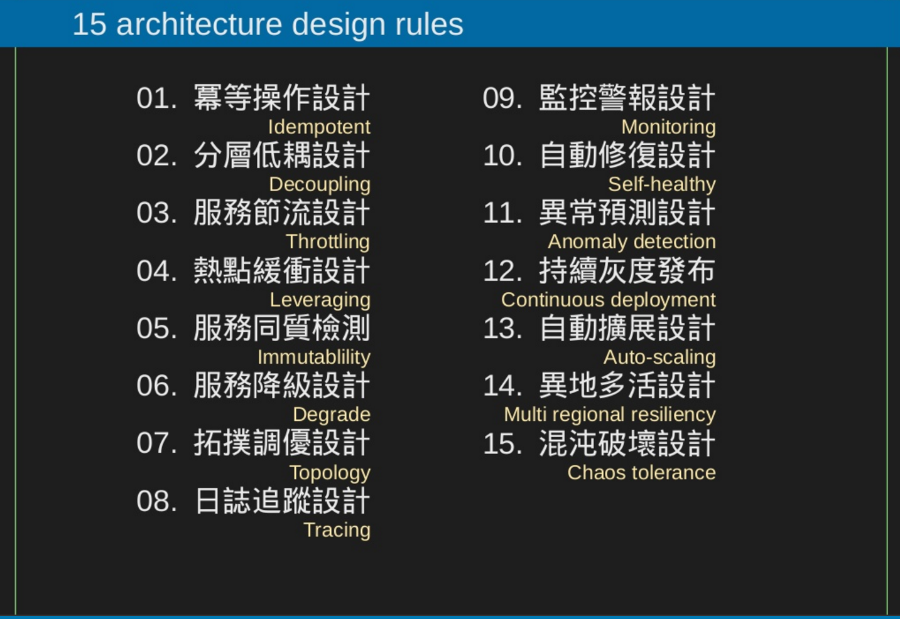

# Coding zone

### Doing
- [演算法筆記](http://www.csie.ntnu.edu.tw/~u91029/index.html)
- [LeeCode](https://leetcode.com/s) , algorithm submission
- [Go](go/README.md)
- [Gooogle Site Reliability Engineering](https://landing.google.com/sre/)

### LINK
- [Algo](algo/README.md)
- [Code Concept](concept/README.md)
- [Linux](Linux/README.md)
- [Server](server/README.md)
    - Nginx
    - Kubernetes
    - 
- [Database](Database/README.md)
- [DevOps](DevOps/README.md)
    - Docker
    -
- Languages
    - [Go](go/README.md)
    - Python
    - [bash](bash/README.md)
    - javascript
    - html5
    - CSS 
    - [makefile](makefile.md)
- Field
    - [cryptographic](cryptographic/README.md)

### Network 
- [Network programming初學](http://beej-zhtw-gitbook.netdpi.net/)

### Online Learning Resource
- [演算法筆記](http://www.csie.ntnu.edu.tw/~u91029/index.html)
- [LeeCode](https://leetcode.com/s) , algorithm submission
- [FreeCodeCampe](http://freecodecamp.com/) , HTML javascript CSS

### Architecture
- 
- [System design interview](https://github.com/checkcheckzz/system-design-interview)
- [System design Concept](https://gist.github.com/vasanthk/485d1c25737e8e72759f)

### Article
- [How does AFS work?](http://www.apache.org/foundation/how-it-works.html) , include commiter level
- 

### Others
- [Choose License](http://choosealicense.com/)

    

### Others
Exams:  
- [ ] [各種程式考題](https://softnshare.wordpress.com/2016/02/21/%E7%A8%8B%E5%BC%8F%E8%AA%9E%E8%A8%80%E9%9D%A2%E8%A9%A6%E8%80%83%E9%A1%8C%E9%9B%86%E9%8C%A6/)

[List of world tech center](https://en.wikipedia.org/wiki/List_of_technology_centers)
[12factor](http://12factor.net/)

SEO:  
- [Tool] [Alexa](http://www.alexa.com/) 
- [查詢網站流量](http://por.tw/seo/rewrite.php/read-72.html)
- [Robot.txt-1](http://www.webconfs.com/what-is-robots-txt-article-12.php)
- [Robot.txt-2](http://www.robotstxt.org/robotstxt.html)

Experiences
- [十年一覺程設夢(上)：在華碩10年的職場經驗 / Eee PC 事業處主管 (2008年)](http://mepopedia.com/forum/read.php?22,7232)
- [十年一覺程設夢(下)：在華碩10年的職場經驗 / Eee PC 事業處主管 (2008年)](http://mepopedia.com/forum/read.php?22,7232,7233)
- [製程工程師的甘苦](http://mepopedia.com/forum/read.php?147,6756)
- [You Should Ask Before Accepting a Startup Job Offer](http://www.inc.com/atish-davda/5-questions-you-should-ask-before-taking-a-start-up-job-offer.html)
- [A Dark Room](https://www.reddit.com/r/startups/comments/4f74dv/quit_my_full_time_corporate_job_built_an_ios_game/)
- [How to Start a Startup](https://whodyo.wordpress.com/2015/12/28/how-to-start-a-startups/)
- [ ] [How to Start a Startup](https://whodyo.wordpress.com/2015/12/28/how-to-start-a-startups/)

Analysis
- [一文讀懂機器學習](http://iguang.tw/u/4219580/article/459124.html)
- [X] [AAARR](http://wapbaike.baidu.com/view/10197444.htm?adapt=1&)

